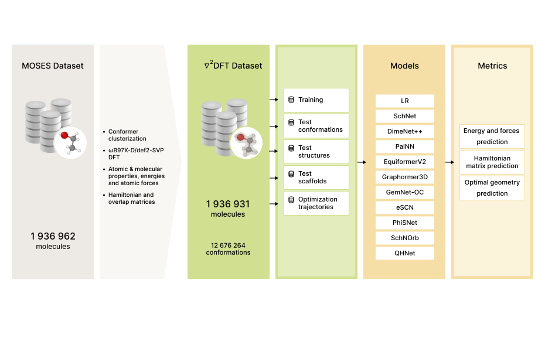

# nablaDFT: Large-Scale Conformational Energy and Hamiltonian Prediction benchmark and dataset
<p align="left">
<a href="https://github.com/psf/black"></a>
</p>
Electronic wave function calculation is a fundamental task of computational quantum chemistry. Knowledge of the wave function parameters allows one to compute physical and chemical properties of molecules and materials.<br/>
In this work we: introduce a new curated large-scale dataset of electron structures of drug-like molecules, establish a novel benchmark for the estimation of molecular properties in the multi-molecule setting, and evaluate a wide range of methods with this benchmark.<br/>

More details can be found in the [paper](https://pubs.rsc.org/en/content/articlelanding/2022/CP/D2CP03966D).


If you are using nablaDFT in your research paper, please cite us as
```
@article{10.1039/D2CP03966D,
author ="Khrabrov, Kuzma and Shenbin, Ilya and Ryabov, Alexander and Tsypin, Artem and Telepov, Alexander and Alekseev, Anton and Grishin, Alexander and Strashnov, Pavel and Zhilyaev, Petr and Nikolenko, Sergey and Kadurin, Artur",
title  ="nablaDFT: Large-Scale Conformational Energy and Hamiltonian Prediction benchmark and dataset",
journal  ="Phys. Chem. Chem. Phys.",
year  ="2022",
volume  ="24",
issue  ="42",
pages  ="25853-25863",
publisher  ="The Royal Society of Chemistry",
doi  ="10.1039/D2CP03966D",
url  ="http://dx.doi.org/10.1039/D2CP03966D"}
```




## Installation

```python
git clone https://github.com/AIRI-Institute/nablaDFT && cd nablaDFT/
pip install .
```

## Dataset

We propose a benchmarking dataset based on a subset of [Molecular Sets (MOSES) dataset](https://github.com/molecularsets/moses). Resulting dataset contains 1 004 918 molecules with atoms C, N, S, O, F, Cl, Br, H. It contains 226 424 unique Bemis-Murcko scaffolds and 34 572 unique BRICS fragments.<br/>
For each molecule in the dataset we provide from 1 to 62 unique conformations, with 5 340 152 total conformations. For each conformation, we have calculated its electronic properties including the energy (E), DFT Hamiltonian matrix (H), and DFT overlap matrix (S). All properties were calculated using the Kohn-Sham method at ωB97X-D/def2-SVP levels of theory using the quantum-chemical software package [Psi4](https://github.com/psi4/psi4), version 1.5. <br/>
We provide several splits of the dataset that can serve as the basis for comparison across different models. First, we fix the training set that consists of 100 000 molecules with 436 581 conformations and its smaller subsets with 10 000, 5 000, and 2 000 molecules and 38 364, 20 349, and 5 768 conformations respectively; these subsets can help determine how much additional data helps various models. We choose another 100 000 random molecules as a structure test set. The scaffold test set has 100 000 molecules containing a Bemis-Murcko scaffold from a random subset of scaffolds which are not present in the training set. Finally, the conformation test set consists of 91 182 (resp., 10 000, 5 000, 2 000) molecules from the training set with new conformations, numbering in total 92 821 (8 892, 4 897, 1 724) conformations; this set can be used for the single-molecule setup. <br/>
As part of the benchmark, we provide separate databases for each subset and task and a complete archive with wave function files produced by the Psi4 package that contains quantum chemical properties of the corresponding molecule and can be used in further computations.
### Downloading dataset
#### Hamiltonian databases
Links to other hamiltonian databases including different train and test subsets are in file [Hamiltonian databases](./nablaDFT/links/hamiltonian_databases.json)<br/>
An archive with numpy indexes:  [splits indexes](https://a002dlils-kadurin-nabladft.obs.ru-moscow-1.hc.sbercloud.ru/data/nablaDFTv2/hamiltonian_databases/splits.tar.gz)<br/>
#### Energy databases
Links to energy databases including different train and test subsets are in file [Energy databases](./nablaDFT/links/energy_databases.json)

#### Raw psi4 wave functions
Links to tarballs: [wave functions](./nablaDFT/links/nablaDFT_psi4wfn_links.txt)

#### Summary file
The csv file with conformations index, SMILES, atomic DFT properties and wfn archive names: [summary.csv](https://a002dlils-kadurin-nabladft.obs.ru-moscow-1.hc.sbercloud.ru/data/nablaDFT/summary.csv)

#### Conformations files
Tar archive with xyz files [archive](https://n-usr-31b1j.s3pd12.sbercloud.ru/b-usr-31b1j-qz9/data/nablaDFT/conformations_archive.tar)

### Accessing elements of the dataset
#### Hamiltonian database

```python
from nablaDFT.dataset import HamiltonianDatabase

train = HamiltonianDatabase("dataset_train_2k.db")
Z, R, E, F, H, S, C = train[0]  # atoms numbers, atoms positions, energy, forces, core hamiltonian, overlap matrix, coefficients matrix
```
#### Energies database
```python
from ase.db import connect

train = connect("train_2k_energy.db")
atoms_data = connect.get(1)
```
#### Working with raw psi4 wavefunctions

A variety of properties can also be loaded directly from the wavefunctions files. See main paper for more details. Properties include DFT matrices:
```python
import numpy as np
import psi4
wfn = np.load(<PATH_TO_WFN>, allow_pickle=True).tolist()
orbital_matrix_a = wfn["matrix"]["Ca"]        # alpha orbital coefficients
orbital_matrix_b = wfn["matrix"]["Cb"]        # beta orbital coefficients
density_matrix_a = wfn["matrix"]["Da"]        # alpha electonic density
density_matrix_b = wfn["matrix"]["Db"]        # beta electonic density
aotoso_matrix = wfn["matrix"]["aotoso"]       # atomic orbital to symmetry orbital transformation matrix
core_hamiltonian_matrix = wfn["matrix"]["H"]  # core Hamiltonian matrix
fock_matrix_a = wfn["matrix"]["Fa"]           # DFT alpha Fock matrix
fock_matrix_b = wfn["matrix"]["Fb"]           # DFT betta Fock matrix 
```
and bond orders for covalent and non-covalent interactions and atomic charges: 
```python
wfn = psi4.core.Wavefunction.from_file(<PATH_TO_WFN>)
psi4.oeprop(wfn, "MAYER_INDICES")
psi4.oeprop(wfn, "WIBERG_LOWDIN_INDICES")
psi4.oeprop(wfn, "MULLIKEN_CHARGES")
psi4.oeprop(wfn, "LOWDIN_CHARGES")
meyer_bos = wfn.array_variables()["MAYER INDICES"]  # Mayer bond indices
lodwin_bos = wfn.array_variables()["WIBERG LOWDIN INDICES"]  # Wiberg bond indices
mulliken_charges = wfn.array_variables()["MULLIKEN CHARGES"]  # Mulliken atomic charges
lowdin_charges = wfn.array_variables()["LOWDIN CHARGES"]  # Löwdin atomic charges
```


## Models
* [Unifying machine learning and quantum chemistry with a deep neural network for molecular wavefunctions (SchNOrb)](https://github.com/KuzmaKhrabrov/SchNOrb)
* [SE(3)-equivariant prediction of molecular wavefunctions and electronic densities (PhiSNet)](./nablaDFT/phisnet/README.md)
* [A continuous-filter convolutional neural network for modeling quantum interactions (SchNet)](./nablaDFT/ase_model/README.md)
* [Equivariant message passing for the prediction of tensorial properties and molecular spectra (PaiNN)](./nablaDFT/ase_model/README.md)
* [Fast and Uncertainty-Aware Directional Message Passing for Non-Equilibrium Molecules (DimeNet++)](./nablaDFT/dimenetplusplus/README.md)
* [EquiformerV2: Improved Equivariant Transformer for Scaling to Higher-Degree Representations (EquiformerV2)](./nablaDFT/equiformer_v2/README.md)
* [Reducing SO(3) Convolutions to SO(2) for Efficient Equivariant GNNs (eSCN)](./nablaDFT/escn/README.md)
* [GemNet-OC: Developing Graph Neural Networks for Large and Diverse Molecular Simulation Datasets (GemNet-OC)](/nablaDFT/gemnet_oc/README.md)
* [Benchmarking Graphormer on Large-Scale Molecular Modeling Datasets (Graphormer3D)](./nablaDFT/graphormer/README.md)
* [Efficient and Equivariant Graph Networks for Predicting Quantum Hamiltonian (QHNet)](./nablaDFT/qhnet/README.md)

### Run
For task start run this command from repository root directory:
```bash
python run.py --config-name <config-name>.yaml
```
For detailed run configuration please refer to [run configuration README](./nablaDFT/README.md).

### Datamodules
To create a dataset, we use interfaces from ASE and PyTorch Lightning.  
An example of the initialisation of ASE-type data classes (for SchNet, PaiNN models) is presented below:
```python
datamodule = ASENablaDFT(split="train", dataset_name="dataset_train_2k")
datamodule.prepare_data()
# access to dataset
datamodule.dataset
```
For PyTorch Geometric data dataset initialized with PyGNablaDFTDatamodule:
```python
datamodule = PyGNablaDFTDataModule(root="path-to-dataset-dir", dataset_name="dataset_train_2k", train_size=0.9, val_size=0.1)
datamodule.setup(stage="fit")
```
Similarly, Hamiltonian-type data classes (for SchNOrb, PhiSNet models) are initialised in the following way:
```python
datamodule = PyGHamiltonianDataModule(root="path-to-dataset-dir", dataset_name="dataset_train_2k", train_size=0.9, val_size=0.1)
datamodule.setup(stage="fit")
```
Dataset itself could be acquired in the following ways:
```python
datamodule.dataset_train
datamodule.dataset_val
```
For more detailed list of datamodules parameters please refer to [datamodule example config](./config/datamodule/nablaDFT_pyg.yaml).

### Checkpoint
Several checkpoints for each model are available here: [checkpoints links](./nablaDFT/links/models_checkpoints.json)

### Examples

Models training and testing example: 
* [PAINN jupyter](examples/PAINN_example.ipynb)
* [Collab](https://colab.research.google.com/drive/1VaiPa05pu-55XR6eR4DXv6cC6fy3lUwJ?usp=sharing)
* [GemNet-OC jupyter](./examples/GemNet-OC_example.ipynb)

Models inference example:
* [GemNet-OC](./examples/Inference%20example.ipynb)

Molecular geometry optimization example:
* [GemNet-OC](./examples/Geometry%20Optimization.ipynb)

### Metrics
In the tables below ST, SF, CF denote structures test set, scaffolds test set and conformations test set correspondingly.

<table border="1" class="dataframe">
  <thead>
    <tr style="text-align: center;">
      <th rowspan="3">Model</th>
      <th colspan="15"> MAE for energy prediction $\times 10^{−2} E_h$ (↓)</th>
    </tr>
    <tr>
      <th colspan="4">Test ST</th>
      <th colspan="4">Test SF</th>
      <th colspan="4">Test CF</th>
    </tr>
    <tr>
      <th>2k</th>
      <th>5k</th>
      <th>10k</th>
      <th>100k</th>
      <th>2k</th>
      <th>5k</th>
      <th>10k</th>
      <th>100k</th>
      <th>2k</th>
      <th>5k</th>
      <th>10k</th>
      <th>100k</th>
      </tr>
  </thead>
  <tbody>
    <tr>
      <td><i>LR</i></td>
      <td><i>4.6</i></td>
      <td><i>4.7</i></td>
      <td><i>4.7</i></td>
      <td><i>4.7</i></td>
      <td><i>4.6</i></td>
      <td><i>4.7</i></td>
      <td><i>4.7</i></td>
      <td><i>4.7</i></td>
      <td><i>4.0</i></td>
      <td><i>4.2</i></td>
      <td><i>4.0</i></td>
      <td><i>4.0</i></td>
    </tr>
    <tr>
      <td><i>SchNet</i></td>
      <td><i>1.71</i></td>
      <td><i>1.44</i></td>
      <td><i>1.64</i></td>
      <td><i>0.85</i></td>
      <td><i>1.37</i></td>
      <td><i>1.10</i></td>
      <td><i>1.29</i></td>
      <td><i>0.48</i></td>
      <td><i>0.56</i></td>
      <td><i>0.63</i></td>
      <td><i>0.88</i></td>
      <td><i>0.28</i></td>
    </tr>
    <tr>
      <td><i>SchNOrb</i></td>
      <td><i>5.9</i></td>
      <td><i>3.7</i></td>
      <td><i>13.3(*)</i></td>
      <td><i>-</i></td>
      <td><i>5.9</i></td>
      <td><i>3.4</i></td>
      <td><i>14.8(*)</i></td>
      <td><i>-</i></td>
      <td><i>5.0</i></td>
      <td><i>3.6</i></td>
      <td><i>14.5(*)</i></td>
      <td><i>-</i></td>
    </tr>
    <tr>
      <td><i>DimeNet++</i></td>
      <td><i>4.34</i></td>
      <td><i>1.10</i></td>
      <td><i>0.76</i></td>
      <td><i>0.63</i></td>
      <td><i>37.58</i></td>
      <td><i>0.59</i></td>
      <td><i>0.37</i></td>
      <td><i>0.26</i></td>
      <td><i>0.42</i></td>
      <td><i>0.10</i></td>
      <td><i>0.09</i></td>
      <td><i>0.07</i></td>
    </tr>
    <tr>
      <td><i>PAINN</i></td>
      <td><i>1.37</i></td>
      <td><i>1.14</i></td>
      <td><i>0.89</i></td>
      <td><i>0.64</i></td>
      <td><i>1.04</i></td>
      <td><i>0.79</i></td>
      <td><i>0.53</i></td>
      <td><i>0.27</i></td>
      <td><i>0.43</i></td>
      <td><i>0.49</i></td>
      <td><i>0.28</i></td>
      <td><i>0.08</i></td>
    </tr>
    <tr>
      <td><i>Graphormer3D-small</i></td>
      <td><i>2.09</i></td>
      <td><i>1.50</i></td>
      <td><i>1.32</i></td>
      <td><i>0.91</i></td>
      <td><i>1.76</i></td>
      <td><i>1.12</i></td>
      <td><i>0.93</i></td>
      <td><i>0.54</i></td>
      <td><i>0.99</i></td>
      <td><i>0.67</i></td>
      <td><i>0.58</i></td>
      <td><i>0.39</i></td>
    </tr>
    <tr>
      <td><i>GemNet-OC</i></td>
      <td><i>3.33</i></td>
      <td><i>1.19</i></td>
      <td><i>0.82</i></td>
      <td><i>0.76</i></td>
      <td><i>2.8</i></td>
      <td><i>0.76</i></td>
      <td><i>0.45</i></td>
      <td><i>0.41</i></td>
      <td><i>0.52</i></td>
      <td><i>0.20</i></td>
      <td><i>0.15</i></td>
      <td><i>0.24</i></td>
    </tr>
    <tr>
      <td><i>Equiformer_V2</i></td>
      <td><i>3.35</i></td>
      <td><i>1.67</i></td>
      <td><i>0.82</i></td>
      <td><i>0.72</i></td>
      <td><i>2.83</i></td>
      <td><i>1.31</i></td>
      <td><i>0.45</i></td>
      <td><i>0.35</i></td>
      <td><i>0.45</i></td>
      <td><i>0.23</i></td>
      <td><i>0.24</i></td>
      <td><i>0.16</i></td>
    </tr>
    <tr>
      <td><i>eSCN</i></td>
      <td><i>2.4</i></td>
      <td><i>1.01</i></td>
      <td><i>1.48</i></td>
      <td><i>0.96</i></td>
      <td><i>1.88</i></td>
      <td><i>0.63</i></td>
      <td><i>1.10</i></td>
      <td><i>0.59</i></td>
      <td><i>0.48</i></td>
      <td><i>0.31</i></td>
      <td><i>0.80</i></td>
      <td><i>0.44</i></td>
    </tr>
  </tbody>
</table>

<table border="1" class="dataframe">
  <thead>
    <tr style="text-align: center;">
      <th rowspan="3">Model</th>
      <th colspan="15"> MAE for forces prediction $\times 10^{−2} E_h*A^{-1}$ (↓)</th>
    </tr>
    <tr>
      <th colspan="4">Test ST</th>
      <th colspan="4">Test SF</th>
      <th colspan="4">Test CF</th>
    </tr>
    <tr>
      <th>2k</th>
      <th>5k</th>
      <th>10k</th>
      <th>100k</th>
      <th>2k</th>
      <th>5k</th>
      <th>10k</th>
      <th>100k</th>
      <th>2k</th>
      <th>5k</th>
      <th>10k</th>
      <th>100k</th>
    </tr>
  </thead>
  <tbody>
    <tr>
      <td><i>SchNet</i></td>
      <td><i>0.44</i></td>
      <td><i>0.37</i></td>
      <td><i>0.41</i></td>
      <td><i>0.16</i></td>
      <td><i>0.45</i></td>
      <td><i>0.37</i></td>
      <td><i>0.41</i></td>
      <td><i>0.15</i></td>
      <td><i>0.32</i></td>
      <td><i>0.30</i></td>
      <td><i>0.37</i></td>
      <td><i>0.14</i></td>
    </tr>
    <tr>
      <td><i>SchNOrb</i></td>
      <td><i>???</i></td>
      <td><i>???</i></td>
      <td><i>???</i></td>
      <td><i>???</i></td>
      <td><i>???</i></td>
      <td><i>???</i></td>
      <td><i>???</i></td>
      <td><i>???</i></td>
      <td><i>???</i></td>
      <td><i>???</i></td>
      <td><i>???</i></td>
      <td><i>???</i></td>
    </tr>
    <tr>
      <td><i>DimeNet++</i></td>
      <td><i>1.32</i></td>
      <td><i>0.20</i></td>
      <td><i>0.14</i></td>
      <td><i>0.071</i></td>
      <td><i>1.36</i></td>
      <td><i>0.19</i></td>
      <td><i>0.13</i></td>
      <td><i>0.067</i></td>
      <td><i>0.26</i></td>
      <td><i>0.12</i></td>
      <td><i>0.10</i></td>
      <td><i>0.062</i></td>
    </tr>
    <tr>
      <td><i>PAINN</i></td>
      <td><i>0.38</i></td>
      <td><i>0.26</i></td>
      <td><i>0.17</i></td>
      <td><i>0.062</i></td>
      <td><i>0.38</i></td>
      <td><i>0.26</i></td>
      <td><i>0.17</i></td>
      <td><i>0.059</i></td>
      <td><i>0.23</i></td>
      <td><i>0.22</i></td>
      <td><i>0.14</i></td>
      <td><i>0.052</i></td>
    </tr>
    <tr>
      <td><i>Graphormer3D-small</i></td>
      <td><i>1.05</i></td>
      <td><i>0.63</i></td>
      <td><i>0.51</i></td>
      <td><i>0.24</i></td>
      <td><i>1.07</i></td>
      <td><i>0.64</i></td>
      <td><i>0.52</i></td>
      <td><i>0.26</i></td>
      <td><i>0.76</i></td>
      <td><i>0.50</i></td>
      <td><i>0.39</i></td>
      <td><i>0.27</i></td>
    </tr>
    <tr>
      <td><i>GemNet-OC</i></td>
      <td><i>0.14</i></td>
      <td><i>0.067</i></td>
      <td><i>0.046</i></td>
      <td><i>0.024</i></td>
      <td><i>0.14</i></td>
      <td><i>0.064</i></td>
      <td><i>0.044</i></td>
      <td><i>0.021</i></td>
      <td><i>0.073</i></td>
      <td><i>0.042</i></td>
      <td><i>0.032</i></td>
      <td><i>0.019</i></td>
    </tr>
    <tr>
      <td><i>Equiformer_V2</i></td>
      <td><i>0.31</i></td>
      <td><i>0.23</i></td>
      <td><i>0.21</i></td>
      <td><i>0.18</i></td>
      <td><i>0.31</i></td>
      <td><i>0.23</i></td>
      <td><i>0.21</i></td>
      <td><i>0.17</i></td>
      <td><i>0.16</i></td>
      <td><i>0.15</i></td>
      <td><i>0.16</i></td>
      <td><i>0.13</i></td>
    </tr>
    <tr>
      <td><i>eSCN</i></td>
      <td><i>0.11</i></td>
      <td><i>0.055</i></td>
      <td><i>0.040</i></td>
      <td><i>0.024</i></td>
      <td><i>0.11</i></td>
      <td><i>0.052</i></td>
      <td><i>0.036</i></td>
      <td><i>0.021</i></td>
      <td><i>0.065</i></td>
      <td><i>0.037</i></td>
      <td><i>0.029</i></td>
      <td><i>0.019</i></td>
    </tr>
  </tbody>
</table>

<table border="1" class="dataframe">
  <thead>
    <tr style="text-align: center;">
      <th rowspan="3">Model</th>
      <th colspan="15"> MAE for Hamiltonian matrix prediction $\times 10^{−4} E_h$ (↓)</th>
    </tr>
    <tr>
      <th colspan="5">Test ST</th>
      <th colspan="5">Test SF</th>
      <th colspan="5">Test CF</th>
    </tr>
    <tr>
      <th>2k</th>
      <th>5k</th>
      <th>10k</th>
      <th>100k</th>
      <th>full train</th>
      <th>2k</th>
      <th>5k</th>
      <th>10k</th>
      <th>100k</th>
      <th>full train</th>
      <th>2k</th>
      <th>5k</th>
      <th>10k</th>
      <th>100k</th>
      <th>full train</th>
    </tr>
  </thead>
  <tbody>
    <tr>
      <td><i>SchNOrb</i></td>
      <td><i>386.5</i></td>
      <td><i>383.4</i></td>
      <td><i>382.0(*)</i></td>
      <td><i>-</i></td>
      <td><i>-</i></td>
      <td><i>385.3</i></td>
      <td><i>380.7</i></td>
      <td><i>383.6(*)</i></td>
      <td><i>-</i></td>
      <td><i>-</i></td>
      <td><i>385.0</i></td>
      <td><i>384.8</i></td>
      <td><i>392.0(*)</i></td>
      <td><i>-</i></td>
      <td><i>-</i></td>
    </tr>
    <tr>
      <td><i>PhiSNet</i></td>
      <td><i>7.4</i></td>
      <td><i>3.2</i></td>
      <td><i>2.9</i></td>
      <td><i>-</i></td>
      <td><i>-</i></td>
      <td><i>7.2</i></td>
      <td><i>3.2</i></td>
      <td><i>2.9</i></td>
      <td><i>-</i></td>
      <td><i>-</i></td>
      <td><i>6.5</i></td>
      <td><i>3.2</i></td>
      <td><i>2.8</i></td>
      <td><i>-</i></td>
      <td><i>-</i></td>
    </tr>
  </tbody>
</table>


<table border="1" class="dataframe">
  <thead>
    <tr style="text-align: center;">
      <th rowspan="3">Model</th>
      <th colspan="15"> MAE for overlap matrix prediction $\times 10^{−5}$(↓)</th>
    </tr>
    <tr>
      <th colspan="5">Test ST</th>
      <th colspan="5">Test SF</th>
      <th colspan="5">Test CF</th>
    </tr>
    <tr>
      <th>2k</th>
      <th>5k</th>
      <th>10k</th>
      <th>100k</th>
      <th>full train</th>
      <th>2k</th>
      <th>5k</th>
      <th>10k</th>
      <th>100k</th>
      <th>full train</th>
      <th>2k</th>
      <th>5k</th>
      <th>10k</th>
      <th>100k</th>
      <th>full train</th>
    </tr>
  </thead>
  <tbody>
    <tr>
      <td><i>SchNOrb</i></td>
      <td><i>1550</i></td>
      <td><i>1455</i></td>
      <td><i>1493(*)</i></td>
      <td><i>-</i></td>
      <td><i>-</i></td>
      <td><i>1543</i></td>
      <td><i>1440</i></td>
      <td><i>1496(*)</i></td>
      <td><i>-</i></td>
      <td><i>-</i></td>
      <td><i>1544</i></td>
      <td><i>1480</i></td>
      <td><i>1536(*)</i></td>
      <td><i>-</i></td>
      <td><i>-</i></td>
    </tr>
    <tr>
      <td><i>PhiSNet</i></td>
      <td><i>5.1</i></td>
      <td><i>4.3</i></td>
      <td><i>3.5</i></td>
      <td><i>-</i></td>
      <td><i>-</i></td>
      <td><i>5.0</i></td>
      <td><i>4.3</i></td>
      <td><i>3.5</i></td>
      <td><i>-</i></td>
      <td><i>-</i></td>
      <td><i>5.1</i></td>
      <td><i>4.6</i></td>
      <td><i>3.6</i></td>
      <td><i>-</i></td>
      <td><i>-</i></td>
    </tr>
  </tbody>
</table>

Fields with - or * symbols correspond to the models, which haven't converged and will be updated in the future.
